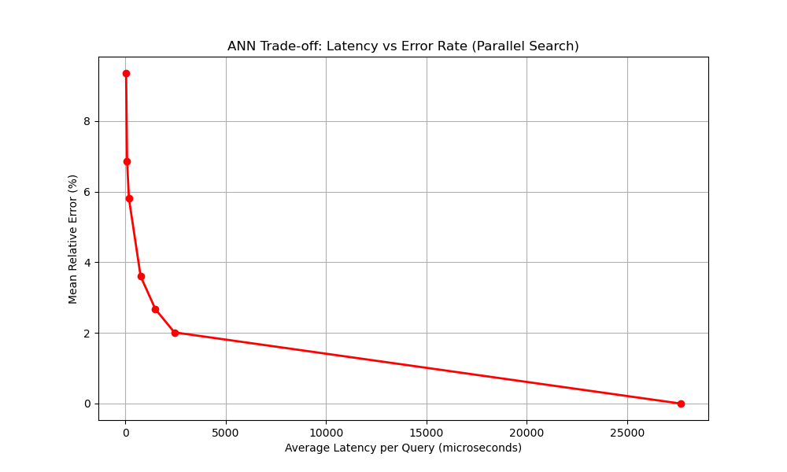

# KD-Tree Based ANN Vector Search in C++

A vector similarity search engine built to study how nearest-neighbor 
search behaves in high-dimensional spaces. Features approximate search 
via bounded backtracking and parallel batch search across all hardware 
threads — achieving 1722x total speedup over brute force on 200k vectors with a 6% percent error.

---

## Benchmark Results (200,000 vectors, 128 dimensions)

| Method | vs Brute Force | Parallel Gain | Total Gain | Error Rate |
|---|---|---|---|---|
| KD-Tree ANN (limit=100) | 1969x | 4.2x | 8296x | 9.4% |
| KD-Tree ANN (limit=1000) | 216x | 8.0x | 1722x | 5.8% |
| KD-Tree ANN (limit=5000) | 42x | 9.1x | 391x | 3.6% |
| KD-Tree ANN (limit=20000) | 10x | 10.2x | 108x | 2.0% |
| Exact KD-Tree (limit=-1) | 1x | 11.8x | 11x | 0.0% |

Parallel search uses all available hardware threads via `std::async`.
Parallel gain plateaus at ~10x due to memory bandwidth saturation 
from random pointer traversal — each node dereference is a potential 
cache miss, and 24 concurrent threads saturate the memory bus faster 
than additional cores can help.

---
## Standalone C++ Benchmark (200,000 vectors, 128 dimensions)

Built and run directly without Python overhead:

| Method | Time | Speedup |
|---|---|---|
| Brute Force Linear | 247,468 µs | 1x |
| KD-Tree ANN (limit=1000) | 1,323 µs | 187x |
```bash
# Build and run standalone
mkdir build && cd build
cmake .. && make
./cpp_bench
```

Distance comparison:
- Linear (exact):         3.445
- KD-Tree (approximate):  3.621
- Error:                  5.1%

## Pareto Frontier

The core tradeoff — lower latency costs accuracy. The `max_nodes` 
parameter controls where you sit on this curve.



A steep drop in error with minimal latency increase happens between 
limit=100 and limit=1000 — this is the practical sweet spot for most 
applications.

---

## How It Works

**KD-Tree Construction**
Vectors are partitioned by splitting along alternating axes at the 
median using `std::nth_element` — O(n log n) build time. Each node 
stores one vector and pointers to left/right subtrees.

**Exact Search**
Recursive descent to the nearest leaf, then backtrack when the 
distance to a splitting plane is less than the current best distance. 
Guaranteed to find the true nearest neighbor but backtracks 
extensively in high dimensions.

**Approximate Search (ANN)**
Bounded backtracking — search terminates after visiting `max_nodes` 
nodes. Explores only the most promising branches and stops early. 
Trades a small accuracy loss for a large latency reduction.

**Parallel Batch Search**
Queries are independent — each query searches the same read-only tree. 
The batch is split across hardware threads with `std::async`, each 
thread processing its chunk with no synchronization needed.


**The Curse of Dimensionality**
Standard KD-tree exact search degrades in high dimensions — distance 
distributions concentrate, pruning becomes ineffective, and the 
algorithm degenerates toward brute force. Bounded backtracking (ANN) 
recovers performance at the cost of accuracy.

---

## Known Limitations

**Memory layout:** KD-tree nodes are heap-allocated individually — 
random memory addresses cause cache misses during traversal. A memory 
pool with contiguous node allocation and index-based linking would 
improve cache locality and parallel scaling.

**Parallel scaling ceiling:** Parallel gain plateaus at ~10x despite 
24 available threads due to memory bandwidth saturation. CPU-bound 
workloads with better cache locality would scale linearly with cores.

**High-dimensional degradation:** KD-trees are effective up to ~20 
dimensions. At 128 dimensions, HNSW or product quantization based 
indexes (FAISS) significantly outperform KD-trees for exact search.

---

## Project Structure
```
kdtree-ann-vector-search/
├── CMakeLists.txt
├── README.md
├── .gitignore
├── src/
│   ├── vector_db.hpp     — KDNode, VectorPoint, VectorStore
│   ├── main.cpp          — standalone C++ benchmark
│   └── bindings.cpp      — pybind11 module
├── python/
│   └── stress_test.py    — full benchmark + Pareto frontier
└── assets/
└── pareto_frontier.png

```

---

## Build

Requires Linux or WSL2 (Ubuntu 22.04+)
```bash
# Install dependencies
sudo apt install build-essential cmake python3-dev
pip3 install pybind11 matplotlib

# Build
mkdir build && cd build
cmake .. && make
cd ..

# Run benchmark
python3 "vector db/stress_test.py"
```

---

## Roadmap

- [ ] Memory pool allocator — contiguous node allocation to reduce 
      cache misses and improve parallel scaling beyond ~10x ceiling
- [ ] Multi-threaded tree construction — currently single-threaded 
      O(n log n) build
- [ ] HNSW comparison — benchmark against hierarchical navigable 
      small world graphs at 128 dimensions
